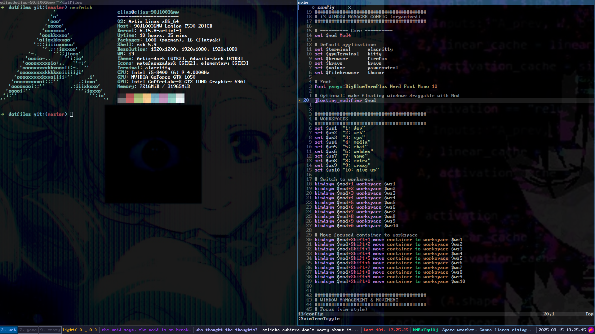

# Dotfiles — Artix (OpenRC) friendly

## Helloooo, these are my dotfiles.
My setup is pretty minimal but meant to help with a lot. It’s still a work in progress.



This is for Artix + OpenRC, but it should work on other Arch-based systems too (nothing here is OpenRC-specific).

What’s inside
.
├─ apps/        # .desktop launchers (show up in rofi “drun”, menus, etc.)
├─ bin/         # small helper scripts (go in ~/.local/bin)
├─ gtk/         # GTK settings for GTK3 apps (Thunar, etc.)
├─ i3/          # i3 WM configuration
├─ i3blocks/    # i3blocks config + scripts
├─ rofi/        # rofi config / themes
└─ screen.png   # screenshot


Tip: peek into each file—most things are documented inline.

Requirements (packages)

Basic stack (Arch/Artix names):

# window manager + bar
```bash
sudo pacman -S i3-wm i3blocks
```

# launcher + terminal
```bash
sudo pacman -S rofi alacritty
```

# compositor + notifications (optional but nice)
```bash
sudo pacman -S picom dunst
```

# file manager + theme helpers
```bash
sudo pacman -S thunar xfce4-settings lxappearance papirus-icon-theme
```

# dotfile manager
```bash
sudo pacman -S stow
```

If you use AUR, install with paru/yay as needed.

Install with GNU Stow (recommended)

Clone and “stow” the pieces you want. Stow creates symlinks in your $HOME so the layout matches.

```bash
git clone https://github.com/<you>/dotfiles ~/dotfiles
cd ~/dotfiles
```

# Preview what will happen:
```bash
stow -nv i3 i3blocks rofi gtk bin apps
```

# Apply (create symlinks in your home):
```bash
stow i3 i3blocks rofi gtk bin apps
```

Uninstall (remove symlinks) any time with:

```bash
stow -D i3 i3blocks rofi gtk bin apps
```

If Stow complains about “existing” files, move your old configs out of the way or use stow -t "$HOME" carefully after backing up.

Post-install notes
## i3

Reload i3 after changes: Mod+Shift+r.

If you rely on themed apps/icons, start an XSettings daemon so GTK apps read your theme:

# Add this to your i3 config (exec on login):
```bash
exec --no-startup-id xfsettingsd
```

## Rofi
Icons in drun mode look better:

// ~/.config/rofi/config.rasi
configuration { show-icons: true; }


You can add your own .desktop files under ~/.local/share/applications (the stuff in apps/).

GTK (Thunar)

Thunar is GTK3, so use themes that include a gtk-3.0/ folder.

Quick example ~/.config/gtk-3.0/settings.ini:

```config
[Settings]
gtk-application-prefer-dark-theme=1
gtk-theme-name=Adwaita-dark        ; or adw-gtk3-dark, Arc-Dark, etc.
gtk-icon-theme-name=Papirus-Dark
gtk-font-name=Inter 11
```

Scripts (bin/)

All scripts are meant to live in ~/.local/bin. Make sure that’s on your PATH:

```bash
echo 'export PATH="$HOME/.local/bin:$PATH"' >> ~/.profile
```

After stowing, mark new scripts executable if needed:

```bash
chmod +x ~/.local/bin/*
```

## How to keep things tidy

Track only config and scripts; avoid secrets, caches, huge folders.

Add a .gitignore for noisy stuff (caches, node_modules, __pycache__, etc.).

For machine-specific tweaks, use a separate file you include from the main config (e.g., an i3/local.conf that isn’t tracked).

Troubleshooting

Rofi app not showing?
Ensure the .desktop file is in ~/.local/share/applications and has a valid Exec= path. Run rofi -show drun -show-icons.

GTK theme not changing in Thunar?
Make sure you edited ~/.config/gtk-3.0/settings.ini (not gtk-4.0), and that xfsettingsd is running. Restart Thunar:
```bash
thunar -q && thunar &
```

Stow conflicts?
Use stow -nv <pkg> to preview, then move or delete existing files that block symlinks.

Credits / License

These configs are assembled from my own tweaks and common Linux rice patterns.
Use anything you like; attribution appreciated but not required. If a subfolder contains third-party snippets, those keep their original licenses.

# thank you for reading!!
